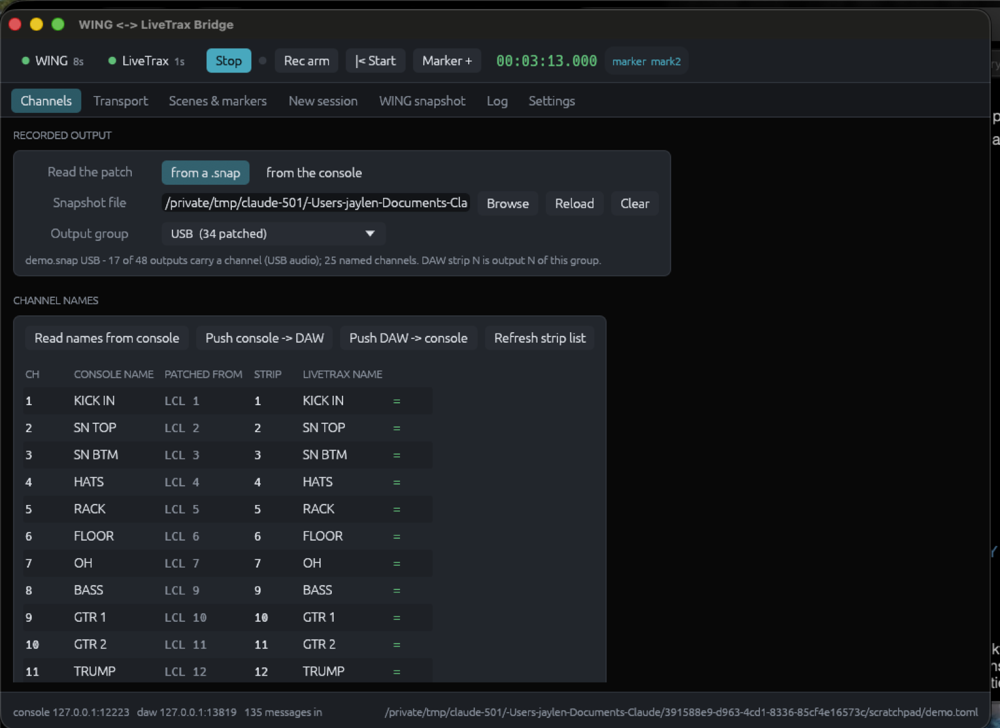
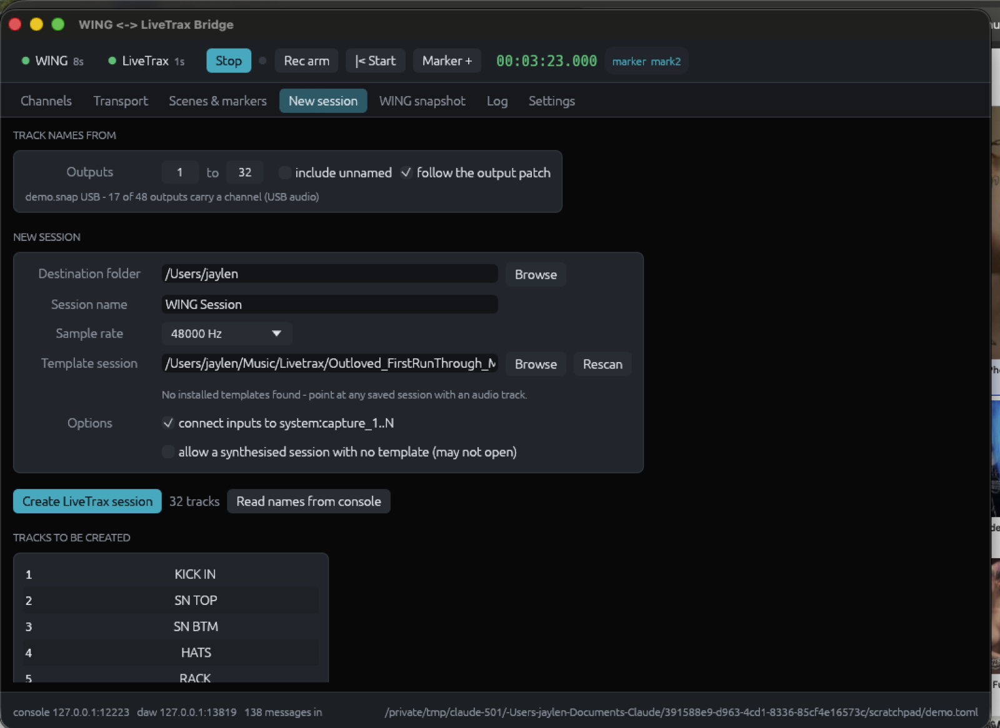
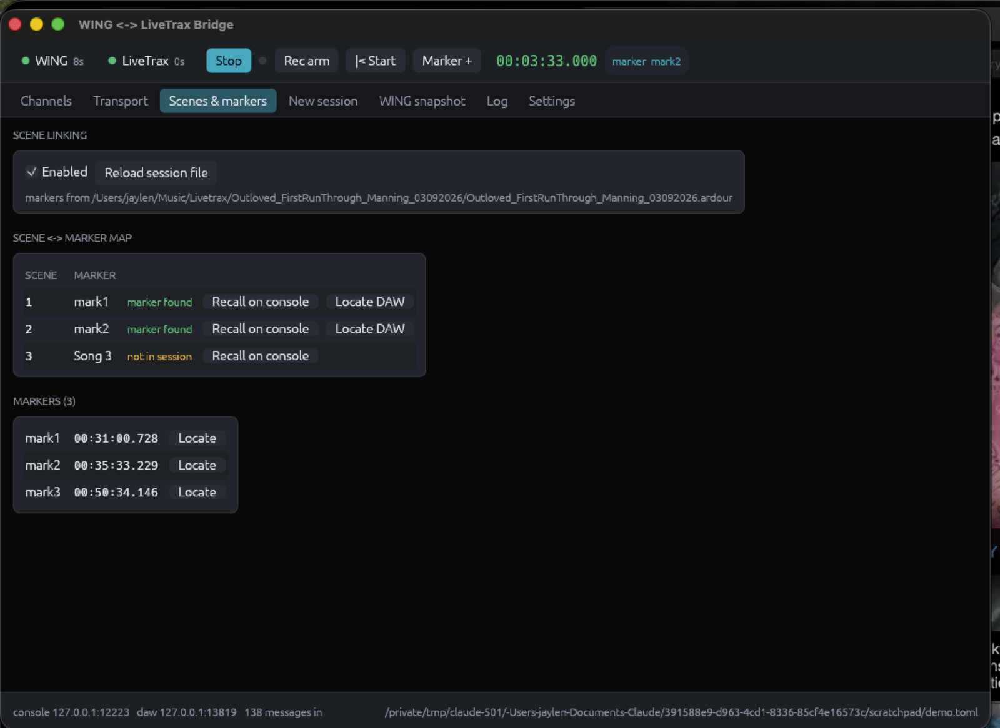
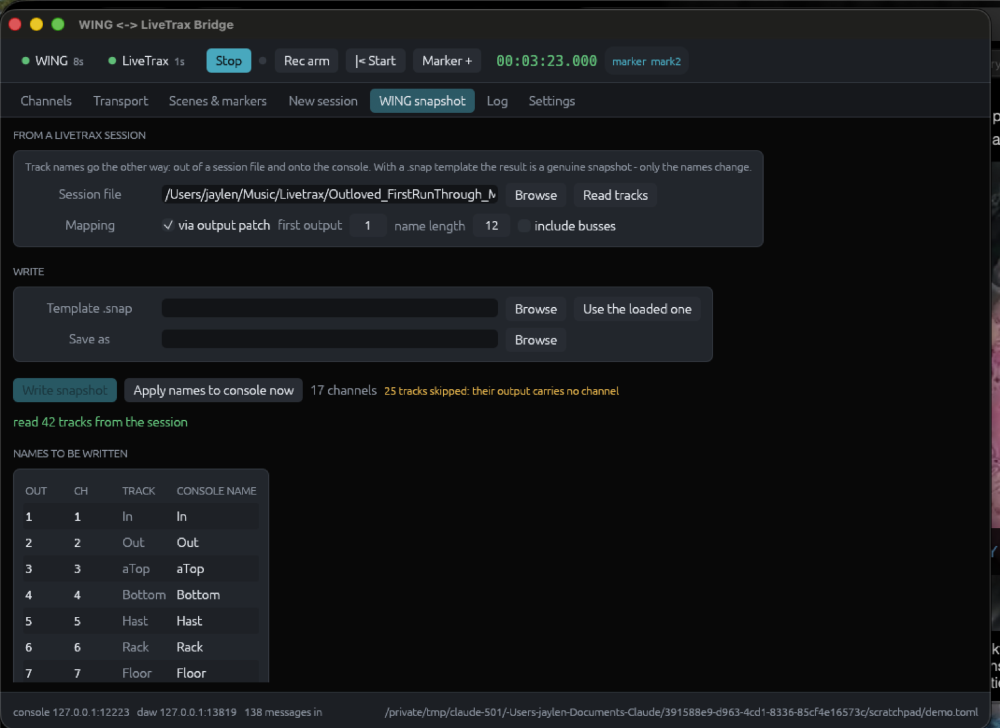
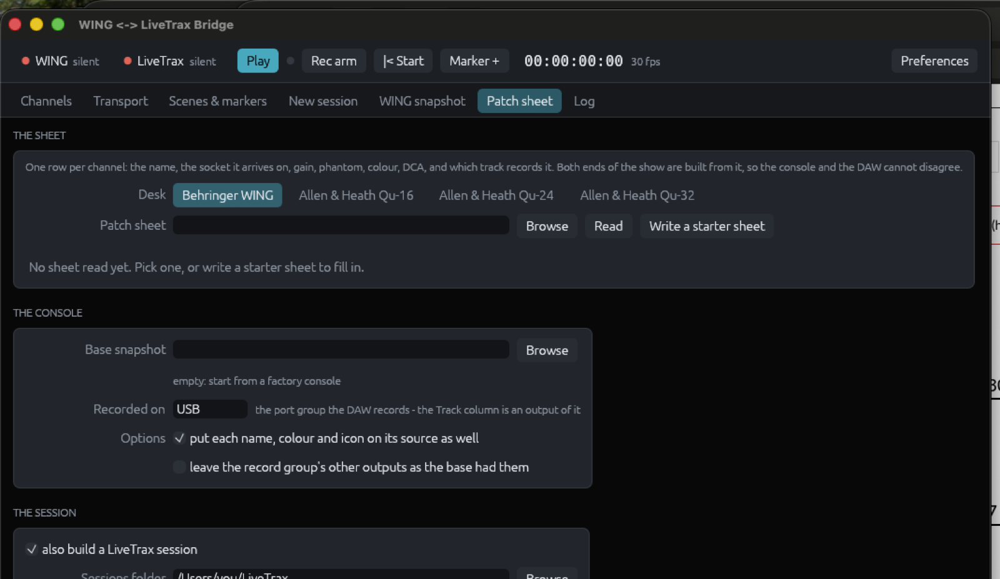

# wing-livetrax-bridge

A small Rust daemon that links a **Behringer WING** to **Harrison LiveTrax 3** over
OSC:

* **Channel name sync** — console channel names ⇄ LiveTrax track names.
* **Transport & record control** — WING user buttons drive play / stop / record
  arm / locate / marker drops, with state fed back to the console's LEDs.
* **Scene ⇄ marker linking** — recalling a WING scene locates LiveTrax to the
  matching marker (or drops a marker named after the scene when the transport is
  already rolling); passing a marker can recall the matching scene.
* **Desktop GUI** — live channel/track table, transport, scene and marker lists,
  log, and settings.
* **Create a session from the console** — one button builds a new LiveTrax
  session whose tracks are named after the WING channels.
* **Offline WING snapshot** — the reverse: write a LiveTrax session's track
  names into a real `.snap`, with no console or DAW running.
* **Build a show from a patch sheet** — for a WING, or a session-only build for
  an Allen & Heath Qu-16/24/32. A spreadsheet of the input list becomes
  both a loadable console snapshot and a matching LiveTrax session.
* **Recorded-output selector** — names follow the console's own output patch,
  so track 14 gets the name of whatever the desk actually sends on output 14.
* **Timecode** — the DAW's SMPTE clock, locate-by-timecode, timecode-named
  markers, and a show log you can export as CSV.
* **Preferences** — every setting in the file is editable in the app.

Both ends are plain UDP OSC, so the bridge can run on the LiveTrax machine, on
the console's network, or on a separate box.

```
  WING  ──OSC/UDP 2223──►  wing-livetrax-bridge  ──OSC/UDP 3819──►  LiveTrax 3
        ◄─────────────────                       ◄─────────────────
```

## Documentation

Full documentation lives in [`docs/`](docs/index.html) — open it locally, or
read it at **<https://jaylenjinx.github.io/Wing-Livetrax/>**, which
[`.github/workflows/pages.yml`](.github/workflows/pages.yml) publishes on every
push that touches `docs/`. The same workflow leaves a single-file copy, images
and all, at [`/site.html`](https://jaylenjinx.github.io/Wing-Livetrax/site.html)
for sharing somewhere with no place to put the screenshots;
`python3 docs/build_site.py` produces it locally.

A docs change arriving by pull request is built but not published, so an image
the page asks for and the repo does not have fails the run rather than reaching
the live site.

## Build

```bash
cargo build --release          # target/release/wing-livetrax-bridge
packaging/bundle.sh            # dist/WING LiveTrax Bridge.app
packaging/bundle.sh --dmg      # ...and a disk image beside it
```

The app and the CLI are one binary: run it with no arguments for the window, or
with a subcommand for the terminal. A double-clicked app has no useful working
directory, so it reads (and on first run writes) its configuration at
`~/Library/Application Support/WING LiveTrax Bridge/config.toml`; an explicit
`-c` always wins, and a `config.toml` in the working directory is preferred when
there is one.

## Set up

1. **On the WING**: Setup ▸ Network — note the IP. OSC (port 2223) is served by
   the firmware; no extra enabling is needed on current firmware.
2. **In LiveTrax**: enable the OSC control surface (Edit ▸ Preferences ▸ Control
   Surfaces ▸ OSC), and note its port — 3819 by default.
3. Create a config and edit the two host addresses:

```bash
wing-livetrax-bridge init -o config.toml
```

4. **Confirm the console's addresses.** This is the one step you should not
   skip: WING's node tree has shifted between firmware revisions, so the bridge
   treats every console address as configuration. Run:

```bash
wing-livetrax-bridge learn
```

   Press the USER button you want to use for transport, then recall a scene. The
   tool prints a ready-to-paste `[[transport.buttons]]` block and the address to
   use for `scenes.scene_address`. Use `probe --target wing` to watch the raw
   stream, and `probe --target daw` for the LiveTrax side.

5. Check the DAW side sees you:

```bash
wing-livetrax-bridge strips     # prints ssid + track name for every strip
wing-livetrax-bridge markers    # prints markers parsed from the session file
```

6. Run it:

```bash
wing-livetrax-bridge -c config.toml
```

That opens the GUI. For a headless daemon use `run` instead, and add `-v` for a
full trace of both directions.

## The GUI



Running with no subcommand (or `gui`) opens the front end. The bridge itself
runs on a background thread; the window is a view onto it, so closing dialogs or
switching tabs never interrupts sync.

* **Header** — link indicators for both ends (green = traffic within 10 s),
  transport buttons, playhead timecode, current marker and scene.
* **Channels** — every mapped pair with the console name beside the LiveTrax
  name and a ✓/≠ match indicator, plus buttons to re-read names from the console
  and to force a push in either direction.
* **Transport** — every transport action the bridge can send, and the current
  roll/record state.
* **Scenes & markers** — the scene↔marker map with a "marker found/missing"
  check per row, buttons to recall a scene or locate the DAW, and the full
  marker list.
* **New session**, **WING snapshot** and **Patch sheet** — described below.
* **Log** — the same log the terminal gets, with warnings and errors coloured.
* **Settings** — toggle name sync, its direction, and scene linking live;
  choose the session file; write the running configuration back to TOML.

## Create a LiveTrax session from the WING

**New session** builds a session folder whose tracks carry the console's channel
names, in channel order.



It works by **cloning a track out of a template session**: pick any session (or
`.template`) that your own LiveTrax wrote and contains at least one audio track,
and the generator copies that route once per channel, renames it and its IO and
ports, renumbers presentation order, assigns fresh unique ids to every cloned
node, and drops the template's playlists, regions, sources and markers. The
route graph in the new session is therefore exactly what your LiveTrax version
produces — nothing is guessed. Installed LiveTrax/Mixbus/Ardour templates are
discovered automatically; the field defaults to your configured session file.

Also handled: names are made port-safe (`/` and `:` become `-`), duplicates are
made unique (`GTR-L`, `GTR-L 2`), unnamed channels are skipped unless you ask
for them, track inputs can be pointed at `system:capture_1..N`, and an existing
folder is never overwritten. A failed write leaves nothing behind.

Same thing from the command line:

```bash
wing-livetrax-bridge new-session --dest ~/LiveTrax --name "Friday Show" --channels 1-32 --template ~/LiveTrax/Empty/Empty.ardour
```

With a `.snap` there is no need for the console to be switched on at all — the
track list comes from the saved output patch:

```bash
wing-livetrax-bridge new-session --dest ~/LiveTrax --name "Friday Show" \
  --from-snap MYSHOW.snap --output USB --outputs 1-34 --include-unnamed \
  --template ~/LiveTrax/Empty/Empty.ardour
```

Without a template the generator refuses rather than guessing; `--allow-minimal`
(the checkbox in the GUI) writes a synthesised session instead, which is a
best-effort file that your build may decline to open.

After a successful create the bridge follows the new session for markers. Open
it in LiveTrax with Session ▸ Open — the generator writes the session, it cannot
tell LiveTrax to load it.

## Which output feeds the DAW


A WING records through one port group — USB, the card, AES50 — and that group's
**output patch** decides which source lands on which track. It is rarely channel
1 to track 1: in a real show file here, USB output 14 carries local input 14,
which is console channel *17*, named "VOX". Mapping channels straight to tracks
would have put five names on the wrong tracks.

So the bridge maps through the patch instead. It can read it two ways, chosen
in the header of the **Channels** tab (or with `patch.source` in the config):

* **from a `.snap`** saved from the console — works with the desk switched off,
  and the dropdown lists every group with how much of it is patched;
* **from the console itself** — press *Ask the console* and the bridge queries
  the live patch over OSC, so it always matches what the desk is doing right
  now. With `source = "console"` it asks automatically at startup.

The snapshot dropdown makes the group feeding the DAW obvious:

```
USB  USB audio - 34 of 48 patched
LCL  Local outputs - 8 of 8 patched
A    AES50-A - 4 of 48 patched
```

From then on, DAW strip N is output N of that group, and the name on it is
resolved back through the patch: a channel's name if a channel owns that input,
the console's own socket label if not, or the mix object — `MAIN 5` becomes
`BAND L`, because the desk's mix objects are stereo and the patch addresses them
one leg at a time.

Everything else follows the same map: name sync, the track list for a new
session, and which channel each track name is written back onto.

```bash
wing-livetrax-bridge snap-info MYSHOW.snap              # list the groups
wing-livetrax-bridge snap-info MYSHOW.snap --output USB # resolve one
wing-livetrax-bridge patch --output USB                 # the same, live
wing-livetrax-bridge patch --groups                     # what the desk answers for
```

Reading it live takes a few hundred small queries — what feeds each output, the
input each channel owns, and the mix object names — paced so they do not outrun
the console's input buffer, followed by a second pass for the sockets no channel
claimed. Replies are collected for `patch.live.settle_ms` and then the map is
rebuilt. If nothing answers, the bridge says so and falls back to the plain
channel map rather than pretending.

## How each feature works

### Names

The console pushes name changes to subscribers; the bridge maps WING channel *N*
to LiveTrax strip *N* (see `[map]`) and renames the track. Changes are debounced
so typing on the console does not produce one message per keystroke, and every
value the bridge writes is remembered briefly so the echo coming back does not
start a ping-pong.

`direction` picks the authority: `wing-to-daw` (console is the source of truth —
the usual live-recording workflow), `daw-to-wing`, or `bidirectional`
(last-change-wins, with echo suppression).

**Rename support caveat:** Ardour-family builds differ on whether a strip can be
renamed over OSC. The bridge watches for the strip-name feedback that should
follow a rename, and if several renames go unconfirmed it logs a warning telling
you to adjust `livetrax.rename_address` or flip to `daw-to-wing`. Name sync in
the DAW→console direction relies only on standard strip feedback and works on
any build.

### Transport and record

Each `[[transport.buttons]]` entry binds one console address to one action —
`play`, `stop`, `toggle_play`, `record_arm_toggle`, `record_start`,
`goto_start`, `goto_end`, `next_marker`, `prev_marker`, `add_marker`,
`{ locate_marker = "Song 3" }`, `{ access_action = "Transport/Record" }`, or a
raw `{ osc = { address = "...", args = [...] } }` escape hatch.

Per-track arming uses `[[transport.rec_arm]]`. DAW transport state is mirrored
back to the console through `[[transport.leds]]`.

### Scenes and markers

`scenes.map` pairs a WING scene index with a LiveTrax marker name:

* **Stopped** — recalling scene *n* locates the playhead to its marker
  (optionally rolling, via `locate_and_play`).
* **Rolling** — recalling scene *n* drops a marker named after the scene at the
  current position instead of jumping, so a scene change during a take is
  logged rather than destructive. Turn off with `add_marker_while_rolling`.
A scene index the console re-reports (which it does on every subscription
refresh) is ignored, so the playhead does not jump on a timer; set
`retrigger_same_scene = true` if you want a deliberate re-recall of the *same*
scene to act again.



* **Reverse** — with `direction = "marker-to-scene"` (or `bidirectional`),
  passing a mapped marker recalls the matching scene on the console. A recall
  the bridge itself caused is not echoed back.

Marker **positions** come from the session file, because LiveTrax does not
publish its location list over OSC. Point `livetrax.session_file` at the
`.ardour` file (or its folder); the bridge re-reads it whenever LiveTrax saves.
Markers created after the last save are learned live from marker feedback plus
the playhead position, so they are usable immediately — but *save the session
after adding markers* if you want them to survive a bridge restart.

## Offline WING snapshot from a session

The **WING snapshot** tab goes the other way: it reads track names straight out
of a session file — no DAW running, no console attached — lays them across
console channels, and either writes a file or pushes the names to the console
over OSC.



A WING `.snap` is JSON mirroring the console's node tree, so with one as a
**template** the output is a genuine, loadable snapshot: the channel names are
replaced and *nothing else in the file is touched*. Names are written onto the
channel feeding each recorded output, so a track always renames the channel it
actually came from. Tracks whose output carries no channel (a bus leg, an
unpatched socket) are reported rather than silently dropped.

Without a template the file written is **node text**: one `<address> <value>`
line per channel, in the same address space the console speaks.

```
# WING channel names from LiveTrax session "MetroSocial_GayCDC"
/ch/1/name In
/ch/2/name Bottom
/ch/3/name "OH SL"
```

That file is readable, editable, and can be replayed to the console by this tool
(`--apply`, or the **Apply names to console now** button). If you export a
snapshot from your own WING and it turns out to be a text file, pass it as a
**Template**: only its name entries are rewritten and everything else is left
byte-for-byte as it was. A binary template is refused rather than corrupted, and
the report lists any channel the template had no line for.

```bash
wing-livetrax-bridge wing-snapshot --session ~/Music/Livetrax/MyShow --out myshow-wing.txt --max-len 8
wing-livetrax-bridge wing-snapshot --session ~/Music/Livetrax/MyShow --apply
```

## Build a show from a patch sheet

A patch is planned in a spreadsheet weeks before anyone touches a console: one
row per channel, with the name, the socket it arrives on, the gain and phantom
that source needs, a colour, a DCA, and which track it records to. The **Patch
sheet** tab reads that sheet and builds *both ends of the show from it* — a
loadable WING snapshot and a LiveTrax session — so the desk and the DAW cannot
disagree about what is on channel 12.



Start from the shipped template, which carries the column reference in comments
at the top and a worked 24-piece band patch below it:

```bash
wing-livetrax-bridge patch-template -o patch-sheet.csv
```

Open it in Excel, Numbers or Sheets, replace the example rows, save as CSV, and:

```bash
wing-livetrax-bridge build --sheet patch-sheet.csv --dest ~/Music/Livetrax --name "Friday Show"
```

That writes `~/Music/Livetrax/Friday Show/` with a track per recorded channel
and `Friday Show.snap` inside it. `--dry-run` prints every node the sheet would
move and writes nothing.

### Other desks

The same sheet builds a session for an **Allen & Heath Qu**:

```bash
wing-livetrax-bridge build --sheet patch-sheet.csv --desk qu-16 \
  --dest ~/Music/Livetrax --name "Friday Show"
```

A Qu has no published file format, so there is no console file to write and no
live control here — the sheet builds the **LiveTrax session only**, from `Ch`,
`Name`, `Colour`, `Track` and `TrackName`. Everything else in the sheet is read
and then reported rather than silently dropped:

```
patch-sheet.csv: 16 channels, 16 tracks for an Allen & Heath Qu-16
warning: an Allen & Heath Qu-16 has no console file to write, so these columns
         were read but not applied: Source, Gain, 48V, DCA
```

`--desk` takes `wing` (the default), `qu-16`, `qu-24` and `qu-32`, and the same
choice sits at the top of the Patch sheet tab. Channels past the desk's input
count are called out — channel 20 on a Qu-16 is a typo worth knowing about
before the session is built. A sheet with no `Track` column at all still
describes a session: on a desk that records its inputs in order, track N is
channel N, and the build says that is what it assumed.

### The columns

| column | meaning |
| --- | --- |
| `Ch` | console channel, 1–40. The only column that must be filled in. |
| `Name` | channel name, up to 16 characters. |
| `Source` | the socket it arrives on: `LCL 1`, `A 12`, `USB 3`, `SC 4`, or `Off`. |
| `Gain` | preamp gain in dB, −3 to 45.5. |
| `48V` | phantom power. |
| `Pol` | polarity invert. |
| `LowCut` | cut frequency in Hz, 20–2000, or `Off`. |
| `Colour` | the console's 1–18, or a name — `RED`, `GREEN`, `BLUE`, `YELLOW`, `CYAN`, `MAGENTA`, `ORANGE`, `PURPLE`, `TEAL`, `LIME`, `SALMON`, `CORAL`, `MINT`, `INDIGO`, `SKY`, `BROWN`, `GREY`, `WHITE`. |
| `Icon` | console icon number, 0–999. |
| `DCA` | DCA membership: `1`, or `1,2`. |
| `MuteGrp` | mute group membership, 1–8. |
| `Fader` | fader position in dB, or `Off`. |
| `Pan` | −100 (left) to 100 (right). |
| `Main` | assign to the main bus. |
| `Mute` | start muted. |
| `Sends` | bus sends as `bus:level` — `"1:-6,3:0"`. A trailing `p` makes one pre-fader. |
| `Link` | `Yes` on the odd channel of a stereo pair. |
| `Track` | which record output, and so which DAW track, carries this channel. |
| `TrackName` | track name, when it should differ from the channel name. |

Columns are found **by name, in any order**, and matched loosely enough that
`48V`, `48 v` and `Phantom` are one column. Columns the reader does not know —
`Mic`, `Stand`, `Notes` — are carried through untouched and listed in the
report, because a real patch list has them and should not have to lose them.
Yes/no cells accept anything from `Y` to `TRUE` to a tick; numbers survive the
units people type (`32 dB`, `+4`, a word processor's `−6`); `Off` is understood
wherever silence makes sense. Every complaint names the line and the column:

```
Error: reading patch-sheet.csv: line 14, Gain: "99" is outside -3 to 45.5
```

### What the sheet does and does not decide

**An empty cell means "leave this alone", not "set it to zero".** The sheet is
an overlay laid onto a base snapshot, so a sheet with only `Ch` and `Name` in it
changes only names. That base is a factory console unless you pass `--base`,
which is how you re-patch a show file whose effects, EQ and bus structure should
survive:

```bash
wing-livetrax-bridge build --sheet patch-sheet.csv --base "Last Tour.snap" \
  --dest ~/Music/Livetrax --name "New Tour"
```

Two rules keep the result loadable. **Nothing is invented** — a node that is not
already in the base is reported, not created, because a WING snapshot is a fixed
tree and a node this tool made up would at best be ignored. And **the types are
the console's**: a whole number is written as an integer and a switch as a
boolean, which is what the desk and WING-Edit both write.

The one place the sheet's shape and the console's differ is the preamp. Gain,
phantom and polarity belong to the **socket**, not the channel, so they are
written by following the channel's input patch to `/io/in/<GRP>/<n>` — which
means the Source column has to be right for the Gain column to land. A digital
source has no preamp to set, and says so rather than quietly doing nothing:

```
warning: line 50: USB 1 has no gain to set
```

DCA and mute-group membership are not fields of their own on a WING: they are
**tags** on the channel, `#D1`–`#D16` and `#M1`–`#M8`. Tags you keep there for
your own grouping survive a DCA change.

Listing sends states the whole picture for that channel — a row that names buses
1 and 3 is saying bus 2 is *off*, not saying nothing about bus 2.

### The Track column, and why gaps become tracks

`Track` is an output of the record group (`--output`, default `patch.output_group`),
and that is what makes the two halves line up: the builder points
`/io/out/USB/<track>` at the channel, and the session's tracks are that group's
outputs in order, wired to `system:capture_<track>`.

Outputs of that group the sheet does not list are switched off, since the sheet
is the authority on what gets recorded; `--keep-unlisted-outputs` leaves them.
A **gap** in the Track column becomes a real, empty, unarmed track — if it were
simply left out, every track after the gap would record the wrong input.

Each track carries the console colour of the channel feeding it, and the
recorded ones are armed. Names are made port-safe and unique (`GTR-L`,
`GTR-L 2`) the same way the New session tab does it.

Because the desk can be set to show a **source's** own name, colour and icon on
the scribble strip rather than the channel's, the two are kept together: the
name, colour and icon go onto the socket as well, so whichever the console is
showing, it is showing the patch sheet. `--no-source-labels` turns that off.

## Timecode

The header shows the DAW's own SMPTE clock — LiveTrax sends it as
`/position/smpte` once the *timecode* feedback bit is on — with the frame rate
beside it. When the DAW is not sending timecode, the bridge works it out from
the playhead instead.

The frame rate and session start come from the session file
(`timecode-format`, `timecode-offset`), so 29.97 drop-frame behaves like
29.97 drop-frame; `[timecode] fps` and `offset` override them when you need to.

* **Go to timecode** — type one into the Transport tab and the transport
  locates there. Drop-frame is accepted with either separator.
* **Timecode-named markers** — a marker dropped by the bridge is named from
  `timecode.marker_template`, `{tc}` by default.
* **Show log** — markers, scene recalls and (optionally) takes, each stamped
  with the timecode they happened at, exportable as CSV for the edit.

## Preferences

Everything in the config file is editable in the app: **Preferences** in the
header, or Cmd-, — console, LiveTrax, names, the recorded output and its live
query addresses, transport bindings, scenes, timecode, snapshots and the manual
map. Ardour's `strip_types` and `feedback` bitmasks are named checkboxes rather
than numbers.

*Apply* hands the whole configuration to the running bridge, which takes on
everything except the sockets themselves; *Save to file* also writes the TOML.
Hosts and ports need a restart, and the window says so.

## Commands

| command | what it does |
| --- | --- |
| *(none)* / `gui` | run the bridge with the GUI |
| `run` | run the bridge headless |
| `new-session --dest D --name N` | build a session named from the console |
| `wing-snapshot --session S [--out F] [--apply]` | console channel names from a session |
| `patch-template [-o F]` | write a starter patch sheet |
| `build --sheet F --dest D --name N` | a snapshot and a session from a patch sheet |
| `build --sheet F --desk qu-16 --dest D --name N` | a session from a patch sheet, for a Qu |
| `snap-info F [--output USB]` | list a .snap's channel names and output patches |
| `patch [--output USB] [--groups]` | read the output patch from the live console |
| `probe [--target wing\|daw\|both] [--filter /ch]` | print every OSC message received |
| `learn` | print ready-to-paste config for whatever console control you touch |
| `strips` | ask LiveTrax for its strip list |
| `markers` | print markers parsed from the session file |
| `send --target daw /transport_play i:1` | send one message by hand |
| `init` | write a starter config |

## Tests

`tests/e2e.py` stands up a fake WING and a fake LiveTrax around the real binary
and drives the whole feature set — name sync in both directions, transport
buttons, LED feedback, marker locates, scene↔marker linking, and the guards
against echo loops and repeated scene reports.

`tests/live_patch.py` stands up a console that answers patch queries the way a
WING would, and checks the whole live path: the resolved table from the `patch`
command, and that a channel sitting on a shifted input has its name land on the
strip its output feeds.

`tests/session_gen.py` drives `new-session` against a fake console and checks
the generated XML: route names and order, renamed IO and ports, dropped playlist
references, unique ids, cleared template media, capture connections, refusal to
overwrite, and clean-up after a refused write.

`cargo test` covers the command paths the GUI drives (forced name pushes,
transport commands, session creation and config round-tripping) against loopback
sockets.

```bash
cargo test
cargo build
python3 tests/e2e.py ./target/debug/wing-livetrax-bridge
python3 tests/session_gen.py ./target/debug/wing-livetrax-bridge
python3 tests/live_patch.py ./target/debug/wing-livetrax-bridge
```

No hardware needed; they use loopback ports 12223/13819.

The session generator and the snapshot exporter have also been run against real
LiveTrax 3 sessions, and a generated session was opened in LiveTrax 3 itself.

## Protocol notes, and what to verify

Two quirks worth knowing about, both handled:

* LiveTrax answers `/strip/list` with an OSC 1.0 **`#reply`** packet. That
  address does not begin with `/`, so strict OSC decoders reject the datagram
  outright; the bridge rewrites it to `/reply` before decoding.
* Ardour 7+ (so LiveTrax 3) stores marker positions in the audio time domain as
  **superclock ticks** (282,240,000 per second), written with an `a` prefix —
  not samples. Treating them as samples puts a 31-minute marker 1,519 hours in.
  Music-time (`b`) markers need the tempo map and are skipped with a warning.

The parts built on **documented, stable behaviour**:

* LiveTrax inherits Ardour's OSC surface: `/set_surface`, `/strip/list`,
  `/strip/name`, `/transport_play`, `/transport_stop`, `/toggle_roll`,
  `/rec_enable_toggle`, `/strip/recenable`, `/locate`, `/add_marker`,
  `/goto_start`, `/next_marker`, `/access_action`, and `/position/samples`
  feedback. Sessions are Ardour-format XML, so `<Location … flags="IsMark">`
  gives marker names and sample positions (Ardour 7+ timeline prefixes such as
  `a123456` are handled).
* WING serves OSC on UDP 2223, reads a value when a message arrives with no
  arguments, and writes it when arguments are present.
* A WING `.snap` is JSON: `ae_data.ch.<n>.name` holds channel names,
  `ae_data.ch.<n>.in.conn` the input each channel owns, and
  `ae_data.io.out.<GROUP>.<n>` the output patch. Verified against a real show
  file from a wing-compact on firmware 3.0.6.

The parts you should **confirm on your own rig with `learn`/`probe`**, and which
are therefore config rather than code:

* the exact channel-name address (`wing.name_address`),
* the live patch addresses (`[patch.live]`) — these are derived from the `.snap`
  tree, which is solid evidence but not the same as seeing your console answer
  them; `patch --groups` tells you in one command whether it does,
* the subscription keep-alive (`wing.subscribe`),
* the scene/snapshot addresses (`scenes.scene_address`, `scenes.recall_address`),
* USER button addresses (they depend on how you assign them on the console),
* whether your LiveTrax build honours `/strip/name` as a setter,
* whether a generated session opens in *your* LiveTrax build. One was cloned
  from a real LiveTrax 3.0-9 session and opened successfully in LiveTrax 3 on
  macOS during development, but try your own before a show, not during one.

Nothing in the bridge hard-codes these: change the TOML, restart, done.

## Running it as a service

macOS (`~/Library/LaunchAgents/com.local.wing-livetrax.plist`) or Linux systemd —
the binary is a plain foreground process that logs to stdout and exits cleanly on
`SIGINT`. Set `RUST_LOG=wing_livetrax_bridge=debug` for more detail.

## Licence

MIT.
